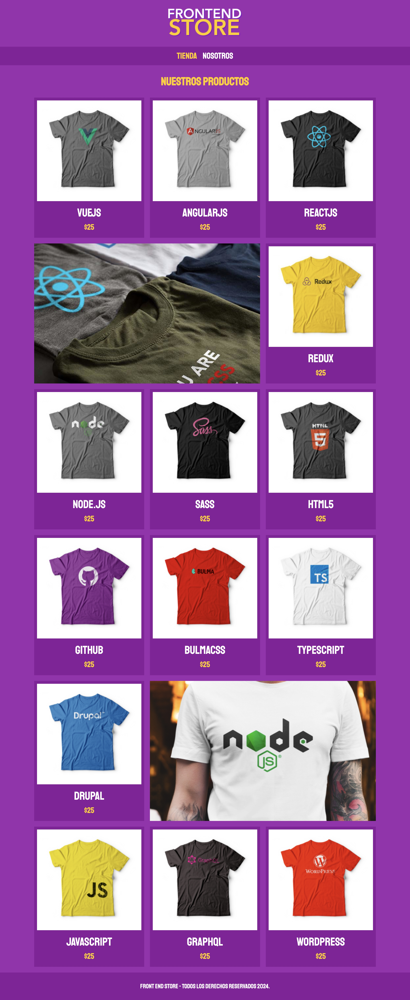
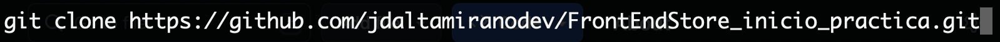
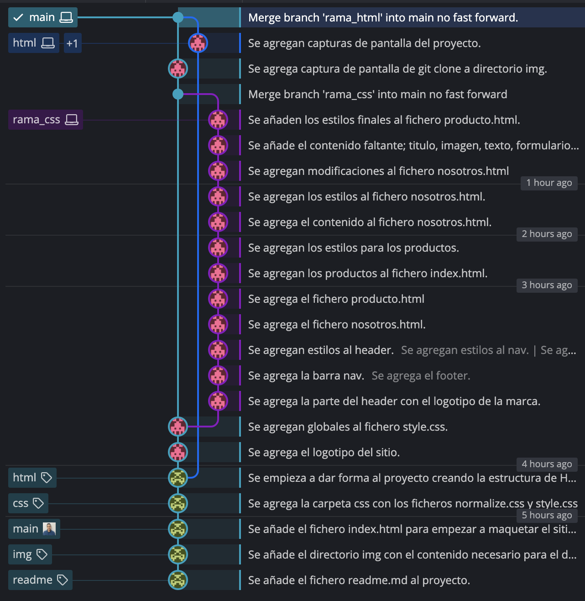

# Sitio Web FrontEnd Store

## Puede ver el sitio FrontEnd Store desplegado en Netlify [FrontEnd Store](https://frontendstore-jose-david-altamirano.netlify.app/)

 

## Tabla de contenido

1. Información general
2. Estado actual
3. Tecnologías utilizadas
4. Instalación y prueba
5. Marcos de competencia
6. Flujo de Trabajo

## Información general

Web estatica modelo E-commercer. Consta de:

* Tienda: Página donde se muestran los productos disponibles, con nommbre y precio.
* Menu de navegación: Inicio, Nosotros.
* Nosotros: Página que contiene una imagen y texto adicional, asi como iconos para dar mayor seguridad de la compra al cliiente.
* Producto: Página de producto que incluye imagen del producto, descripción, talla, precio y boton comprar como todo E-commerces.

## Estado actual

Finalizado.

## Tecnologías utilizadas

* HTML5
* CSS3
* Mac OS
* Terminal de Mac Os
* Git
* GitHub
* GitKraken
* Netlify
* Visual Studio Code
* Trello

## Instalación y prueba

1. Copia la URL del proyecto
   
```
https://github.com/jdaltamiranodev/FrontEndStore_inicio_practica.git
```

2. Abra una terminal, selecione la carpeta donde desea clonar el proyecto, después use el comando git clone y pegue la URL al final dejando un espacio.
3. Finalmente pulse enter. (Tenga en cuenta que debe tener instalado git)

 

```
$ git clone https://github.com/jdaltamiranodev/FrontEndStore_inicio_practica.git
```
* Opcional: Puede copiar y pegar la linea anterior en su terminal en la carpeta elegida para clonar el proyecto.

4. Navegue hasta la carpeta clonada, abra el archivo index.html. Presione el botón derecho del ratón y elija la opción "Abrir en navegador predeterminado". Se abrira el navegador en la pagina principal del proyecto y podrá navegar por el mismo.
   
## Marcos de competencia

* HTML5
* CSS3
* Flex Box
* CSS Grid
* Tablet Icon
* Normalize
* Responsive Design
* Responsively
* Mac OS
* Terminal de Mac OS
* Chrome
* Firefox
* Safari
* Git
* GitHub
* GitKraken
* Netlify
* Visual Studio Code
* Trello

## Flujo de Trabajo

 
